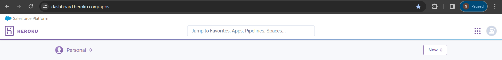
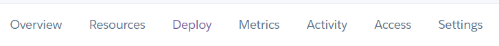

# The Oak

## User

### First Time User

- For a first time user should be able to navigate through the website with ease. This means that they should be able
to go to each page and find information that they are looking for.

- The sign in and register process should be smooth and easy to detect if an error occurs in the registering process.

- The user should know if they are signed in to the website.

### Returning User

- A returning user should be pleased with the way the website is arranged and the booking system should be efficient.

### Frequent User

- A frequent user should find it easy to login to a previous account that has been registered to this website.

## Purpose

- The purpose of this is to create a website for a restaurant that includes a way to book a reservation. 

#### Customer Reservation

- As a site user you need to be able to make a reservation at the restaurant at a specific date and time so that they can plan their day around it.

Acceptance Criteria:
AC1: A site user should be able to book a reservation at the restaurant successfully in advance.

AC2: The site user should be able to choose a specific date and time for their reservation.

#### Booking Availability

- When working at a restaurant you should be able to manage the tables in order to make it as efficient as possible.

AC1: There should be a maximum people that are allowed in a group when making a reservation in order to not over populate the restaurant.

AC2: The system should change automatically when a reservation is made for the date and time to reduce chance of having to refuse people due to to many people being there.
#### Details of Reservation

The site user should be able to give the person who is making a reservation details about the restaurant so that they can choose based on their preferences.

AC1: The website should show available dates and times that the user can choose from.
AC2: The user should see be asked how many people would they want to take with them to the restaurant.

#### Device Compatibility

As a site user I should be able to user the website on a variety of devices.

AC1: The appearance of the website should change depending on the device I use.

AC2: Every part of the website should be compatible including forms, images, header and footer.

#### View Menu

Users should be able to view what the restaurant contains before making a booking.
The site should show a variety of foods and drinks in an presentable way.

AC1: Show a list of clear display of what the food or drink is.

#### Delete Reservation

AC1: An user needs to be able to delete reservations in order for them to be able to change their mind in the future and a easy way to cancel.

AC2: This should also remove the booking in the admin page.

#### Login

AC1: The user should be able to log in to their account that they have previously registered

AC2: The should be able to log in whenever they are on the website.

#### Login Message

AC1: There should be a log in message to let the user know if they are logged in to their account.

AC2: It should be a clear message for the user to see.
#### Logout

AC1: There needs to be a easy way to logout of their account.

AC2: Once logged out the user should know and be able to find a way to log back in.

## About

This is a restaurant booking system. The objective of this is to allow the user to succesfully book a reservation.
It should also allow the user to edit and view the booking they have made.

## Design

- I have chosen the design because it is simple but also very useful. This is because the user can see what the website contains
while being able to navigate with ease.

## Wireframes

### Desktop Device

### Tablet Device

### Mobile Device

## Features

- A booking system is one of the main features. This allows the user to easily make a reservation at this restaurant
from an options of days and times. This form makes sure that there are tables available at the specific
time that the user has asked for. Once succesfully booked a reservation this information will be placed in an admin page
which can be seen by users with access.

- The admin page is a part of the project which specific people can access. They can see all the bookings that have been
made and the time and date they have booked a table for. There are filters which I have placed through the admin.py page,
this can make the user of the admin page's task much easier since they can look through data will ease.

- In the website there is a way to register an account with the website. This will allow them to log in to the account which
is crucial in order to make bookings. The form for this will make sure that the password that the user has is secure enough
so that their account is safe.

- Along with a register system there also need a log in system which will allow the user to log in to the website with just
their username and password which makes it very simple. This will allow them to log in and make a booking, since it has been
made to only show the booking page for when people are logged in. This is to ensure that we know who is making each
reservation.

- Since there is a login and register there also needs to be a logout system which is very simple for the user. On each page
it will show you if you are logged in and an option to logout, all the user needs to do it press the link that is available.

## Colour Palette

For this project I have used a mostly light color palette as this is very visually pleasing and to look. When using darker colours it can be difficult to look at for long periods of time.

The header and footer are beige colour which is clearly visible compared to the background which is a plain white colour. The colours are very basic. 

The text is also white usually with a background with the same beige colour as the header and footer. This makes a very pleasing aesthetic. There is also black text on the white background which is also very basic but shows it as very clear.

## Typography

This font is called 'dancing script' which I have used in this document. I have used this from the google [fonts](https://fonts.google.com/specimen/Dancing+Script?query=dancing).

I have used this because I find that it is very appealing for a website as it gives the impression the restaurant is higher class then the average restaurant.

I have mixed this with a font weight in css to make the font look thicker and stand out more.

## Choice Of Images

For this project I have only used four different images. These can be found on the home page. This displays a small slideshow of these images and they represent the foods that will be served at this restaurant. This gives the user of the website some insight into the type of restaurant the oak is.

## Favicon

I have used this particular favicon because it is an oak tree leaf. This may be a small detail, but it is important for the favicon to have a straight forward connection to what the restaurant it.

## Technology Used

- Python was the main component used to create the server of the website.
- HTML is used to make the main structure of the pages
- CSS is used to decorate and style all the different pages.
- Javascript is used to create interactive section in the website
- Django is the framework of python that was used.
- Bootstrap was also used to create an interactive website.
- Elephant Sql was used in order to host the database and store the data we will recieve.
- Heroku was the website that was used in order to deploy the website.
- Gitpod was used to write the code.
- Git Hub was where the repository and code is stored.
- SQLite was used to develop the database
- Whitenoise to help handle the static files.
- W3C Validator is used to make sure all the html is valid
- W3C CSS validator was used to check the css was all valid

## Testing

- Please visit [TESTING.md](TESTING.md).

## Credits

I learnt how to create the login and logout through this [video](https://www.youtube.com/watch?v=z4lfVsb_7MA&t=375s)

I also learnt how to create the register form through this [video](https://www.youtube.com/watch?v=Ev5xgwndmfc&t=975s)

The link to the food image I have used is from this [website](https://eu.usatoday.com/story/money/personalfinance/2017/10/13/12-tips-saving-money-fancy-restaurants/750778001/)

The dining image I have found is from this [website](https://www.pexels.com/photo/wine-glasses-on-table-tops-941861/)

The second image in the slideshow is from this [website](https://luxurylaunches.com/wp-content/uploads/2016/06/Worlds-top-10-restaurants-1170x765.jpeg)

The fourth image is from this [website](https://www.oliversmarket.com/make-me-a-match-pairing-wine-food/)

I used the same footer which I created in my my 'Man Utd project'.

In order to get my favicons I used the website [fontawesome](https://fontawesome.com/)

I learnt how to add django messages using this [video](https://www.youtube.com/watch?v=VIx3HD2gRWQ)

I learnt and used the drop down menu shown in this website for the 'menu' function in the header through this website [W3School](https://www.w3schools.com/howto/howto_css_dropdown.asp) this replaced my old one which moved other features when hovered over. I used both the html and css that was from this page of the website due to this header being a lot more efficient then my own one I previously created.

I learnt how to do the back button using javascript from this 

I also learnt how to do the data time format from this 

## Bugs

### Solved Bugs

- There was a bug that I encountered which occured when I submitted the booking form. This showed an integrity
error since there needed an userid, in order to fix this I made the form require a login which needed an username.
I made it so the username was in place for the userid, this then allowed me to fix the problem I was encountering.

- A bug that occured was that I had a server error and a bad request error which stemmed from an incorrectly made
whitenoise storage. These errors on happened wheb debug was false, this made it challening to find a cause for it.

### Unsolved Bugs

There is one unsolved bug where due to the login template, after you go on the log in page the url will have 'login/'
on it which can cause problems. This is a bug that I was unable to fix.

- An unsolved bug is that in the validation some python was too long for the validation which caused it to not be perfectly validated.

### Mistakes

- In git commit ff582d0 I made a slight mistake in the text I used to describe the changes. It is "CMake a meta 
class for register form" this shows the mistake I made as I didnt mean to add a C at the start of the world "Make".

- Also in the git commit "984f726" I also accidentally make a mistake in the text I made to describe the git commit.
"Add fiCreate booking function", the mistake it that there is "fi on the start of the word "create".

- In the directory the html files are in an "alluth/account" but they should be in the base templates folder.

## Deployment

- My app was deployed to heroku

- My database was deployed to Elephantsql

### Heroku

Create a application
 

 Go to the deploy section

 

 Link your github account

 

Add the correct configurations

 

Add appropriate buildpacks

 

Manually deploy the workspace

### Elephant SQL

First Name the and decide the plan theat you have chosen.

Select the region that is the closest to you/

View if everything looks correct and finally create the database.

Obtain the url from elephant sql and use this to link to the project

### Local

- Clone or create a repository

- Install Dependencies

*Note:*
  - `pip3 install -r requirements.txt`

This will download the neccessities for this project.

- Set up Environmental Variables

*Note:*
- Secret Key and Database Url in env.py

- Apply migrations

*Note:*
- `python3 manage.py makemigrations`
- `python3 manage.py migrate`

- Collect Static

*Note:*
- `Python3 manage.py collectstatic`

- Run server

*Note:*
- `python3 manage.py runserver`