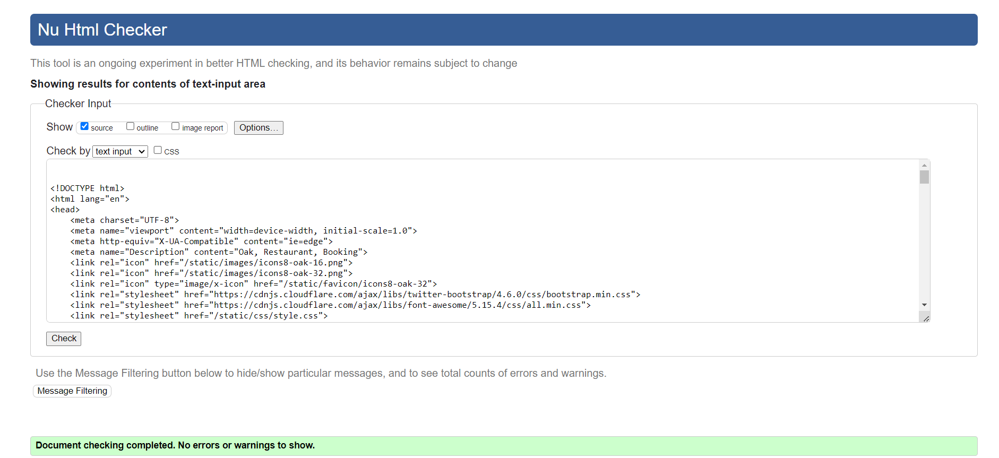
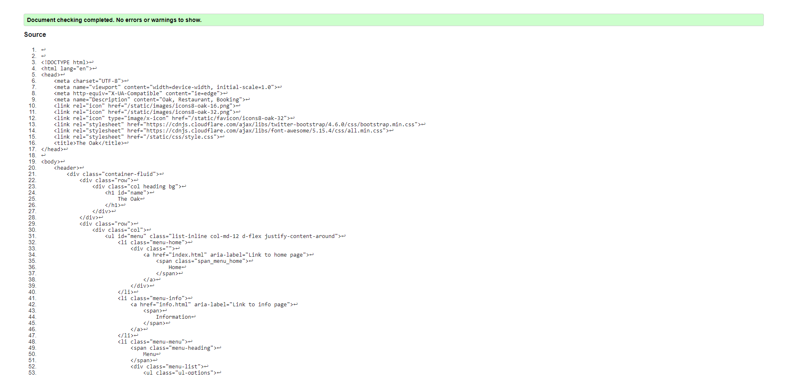
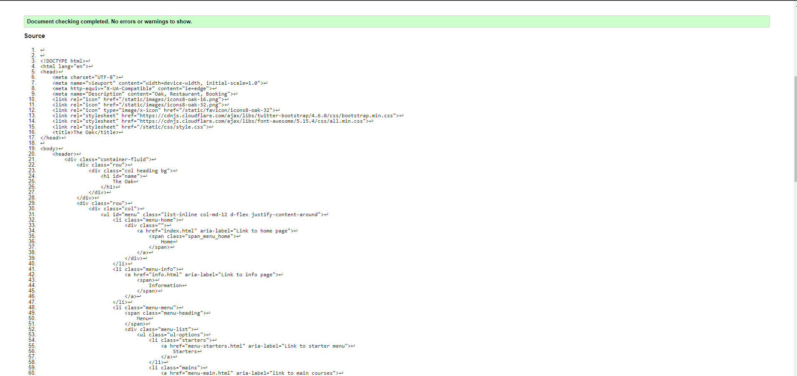
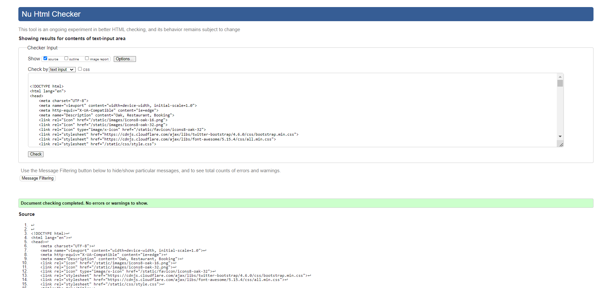
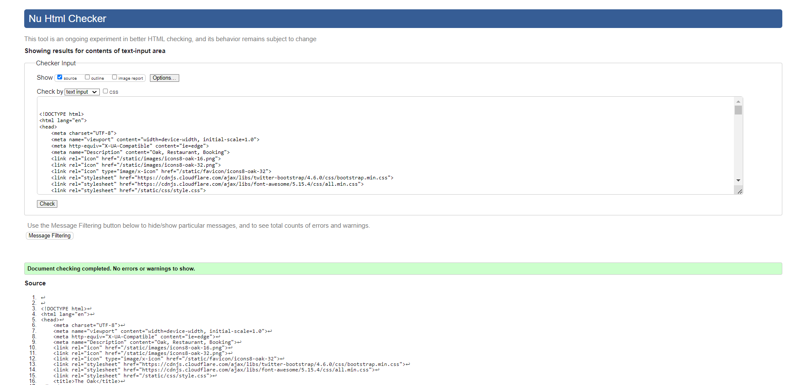
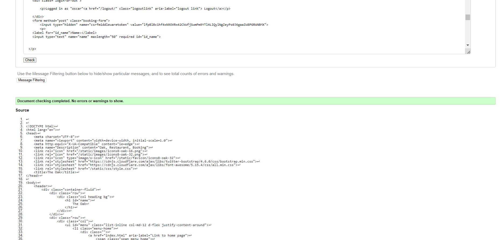
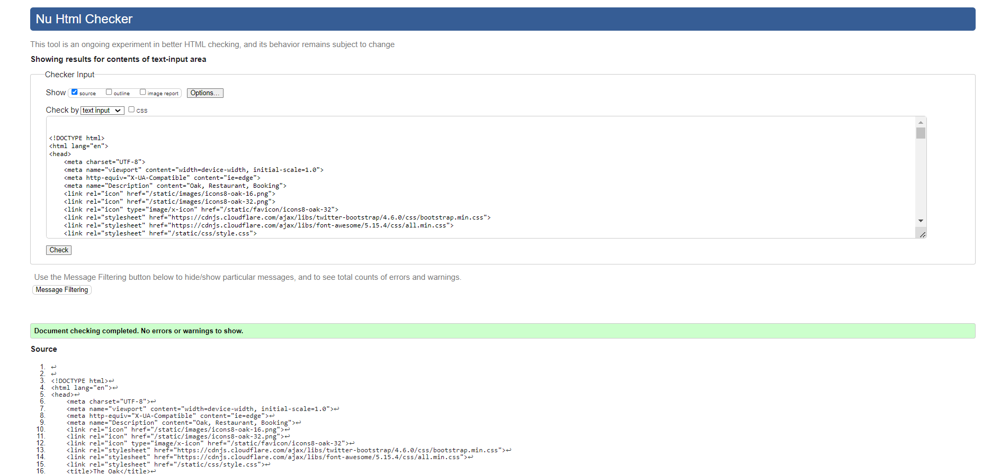

[text](TESTING.md)

# Testing

## Manual Testing

| Feature | Action | Expected Result | Tested | Passed | Comments |
| Next Button | Click next button | Change image | Yes | Yes |  |
| Logout/Login | Click on login/logout | User should logout or should get sent to login page | Yes | Yes | Changes whether user is authenticated or not |
| Link to info page | Click a link | Move to info page | Yes | Yes | --- |
| Link to starters page | Click a link | Move to starters page | Yes | Yes | --- |
| Link to mains page | Click a link | Move to mains page | Yes | Yes | --- |
| Link to desserts page | Click a link | Move to desserts page | Yes | Yes | --- |
| Link to drinks page | Click a link | Move to drinks page | Yes | Yes | --- |
| Link to booking page | Click a link | Move to booking page | Yes | Yes | --- |
| Link to sign up page | Click a link | Move to login page | Yes | Yes | --- |
| Link to register page | Click a link | Move to register page | Yes | Yes | --- |
| Make booking form | create reservation | Make a booking which relays to admin | Yes | Yes | --- |
| Delete booking | delete booking | remove a booking that previously been made | Yes | Yes | --- |
| View booking | view reservations | Once booked a reservation user is able to view it | Yes | Yes | --- |
| Register | Fill in a register form | Fill a form and create a user in the website | Yes | Yes | --- |
| Register check | Automatically checks from | If fields arent correct it will not accept the form | Yes | Yes | --- |
| Login | Fill in log in | Fill in log in form with info which user registered with | Yes | Yes | --- |
| Table amount | An amount of table available | If theres too many people booked for a specific time the system will not allow it. | Yes | Yes | --- |
| Instagram icon in the footer | Click on the Instagram icon | The user is redirected to the Instagram page | Yes | Yes | It should open the link in another tab or page |
| Facebook icon in the footer | Click on the Facebook icon | The user is redirected to the Facebook page | Yes | Yes | It should open the link in another tab or page |
| Twitter icon in the footer | Click on the Twitter icon | The user is redirected to the Twitter page | Yes | Yes | It should open the link in another tab or page |
| YouTube icon in the footer | Click on the YouTube icon | The user is redirected to the YouTube page | Yes | Yes | It should open the link in another tab or page |

## Validation

### Home Page

### Information Page

### Starters Menu

### Main Menus

### Dessert Menu

### Drinks Menu

### Booking

### Make Booking

### View Booking

